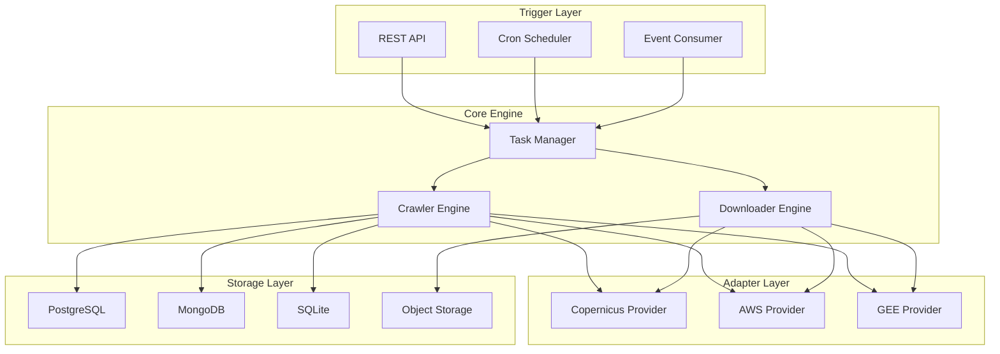
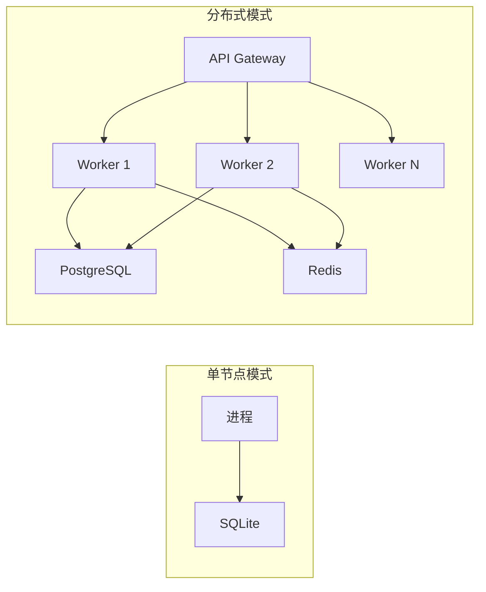

# Sentinel Crawler 架构设计文档

## 1. 设计目标

构建一个**通用、可扩展、高可用**的欧空局哨兵卫星数据及元数据爬虫系统，支持：
- 多数据源无缝切换（Copernicus Data Space、AWS Open Data、Google Earth Engine 等）
- 元数据抓取与原始影像下载的解耦
- 多种存储后端可插拔（PostgreSQL、MongoDB、SQLite、S3 等）
- 多种触发方式共存（定时调度、API 手动触发、事件驱动）
- 水平扩展与分布式部署能力

## 2. 核心设计原则

| 原则 | 说明 |
|------|------|
| 面向接口 | 所有核心组件通过 Go interface 抽象，便于替换与 Mock 测试 |
| 依赖注入 | 使用构造函数注入依赖，组件之间无硬编码耦合 |
| Context 驱动 | 所有 I/O 操作接受 `context.Context`，支持超时与取消 |
| 错误包装 | 使用 `fmt.Errorf("...: %w", err)` 保留完整错误链 |
| 优雅关闭 | 支持 graceful shutdown，确保任务状态不丢失 |

## 3. 系统架构图



## 4. 模块职责

### 4.1 触发层（Trigger Layer）
- **REST API**：提供 HTTP 接口创建、查询、取消抓取任务
- **Cron Scheduler**：基于 cron 表达式的定时任务调度
- **Event Consumer**：监听消息队列（如 Kafka、RabbitMQ）中的事件

### 4.2 核心引擎（Core Engine）
- **Task Manager**：任务生命周期管理（创建、排队、执行、完成、失败重试）
- **Crawler Engine**：元数据搜索、分页、过滤、去重
- **Downloader Engine**：多线程下载、断点续传、MD5/SHA 校验

### 4.3 适配层（Adapter Layer）
- **Provider Interface**：统一的数据源接口
- 具体实现：Copernicus Data Space API、AWS S3、Google Earth Engine API

### 4.4 存储层（Storage Layer）
- **Metadata Repository**：元数据持久化接口
- **Task Repository**：任务状态持久化接口
- 具体实现：PostgreSQL、MongoDB、SQLite、本地文件系统

## 5. 关键接口设计

### 5.1 数据源 Provider

```go
type Provider interface {
    Name() string
    Search(ctx context.Context, query SearchQuery) (*SearchResult, error)
    Download(ctx context.Context, product Product, dest string) error
    Authenticate(ctx context.Context, creds Credentials) error
}
```

### 5.2 元数据存储

```go
type MetadataRepository interface {
    Save(ctx context.Context, product *Product) error
    FindByID(ctx context.Context, id string) (*Product, error)
    FindByQuery(ctx context.Context, query ProductQuery) ([]*Product, error)
    Exists(ctx context.Context, id string) (bool, error)
}
```

### 5.3 任务管理

```go
type TaskManager interface {
    CreateTask(ctx context.Context, spec TaskSpec) (*Task, error)
    GetTask(ctx context.Context, id string) (*Task, error)
    ListTasks(ctx context.Context, filter TaskFilter) ([]*Task, error)
    CancelTask(ctx context.Context, id string) error
}
```

## 6. 数据模型

### 6.1 Product（卫星产品）

```go
type Product struct {
    ID           string
    Name         string
    Platform     string    // S1A, S1B, S2A, S2B, S3A, S3B, S5P
    ProductType  string    // GRD, SLC, OCN, L1C, L2A, etc.
    SensingDate  time.Time
    IngestionDate time.Time
    Footprint    geojson.Geometry
    Size         int64
    DownloadURL  string
    Checksum     string
    Metadata     map[string]interface{}
    RawXML       string    // 原始元数据 XML
    Source       string    // 数据源标识
    CreatedAt    time.Time
    UpdatedAt    time.Time
}
```

### 6.2 Task（抓取任务）

```go
type Task struct {
    ID        string
    Type      TaskType    // MetadataCrawl, Download, FullPipeline
    Status    TaskStatus  // Pending, Running, Completed, Failed, Cancelled
    Spec      TaskSpec
    Progress  float64
    Error     string
    StartedAt *time.Time
    EndedAt   *time.Time
    CreatedAt time.Time
}
```

## 7. 配置管理

支持多级配置覆盖：
1. 默认值（代码中内置）
2. 配置文件（`configs/config.yaml`）
3. 环境变量（`SENTINEL_CRAWLER_*`）
4. 命令行参数

## 8. 部署架构



- **单节点模式**：SQLite + 本地文件存储，适合个人开发/小规模使用
- **分布式模式**：PostgreSQL + Redis（任务队列）+ 多个 Worker，适合生产环境

## 9. 扩展点

| 扩展点 | 说明 |
|--------|------|
| Provider | 实现 `Provider` 接口即可接入新数据源 |
| Storage | 实现 `MetadataRepository` / `TaskRepository` 即可切换数据库 |
| Pipeline Hook | 在抓取流程中插入自定义处理（如格式转换、缩略图生成） |
| Middleware | API 层的认证、限流、日志中间件 |
