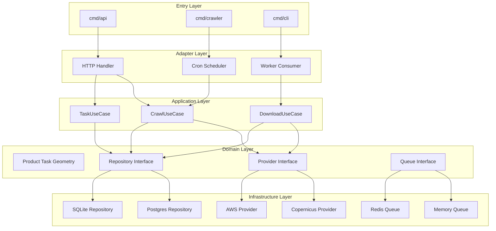
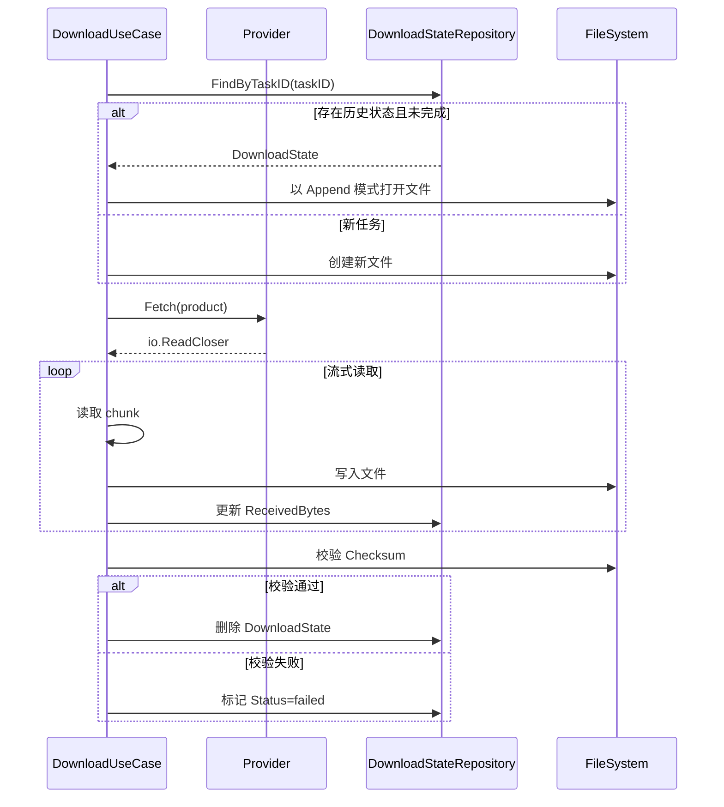
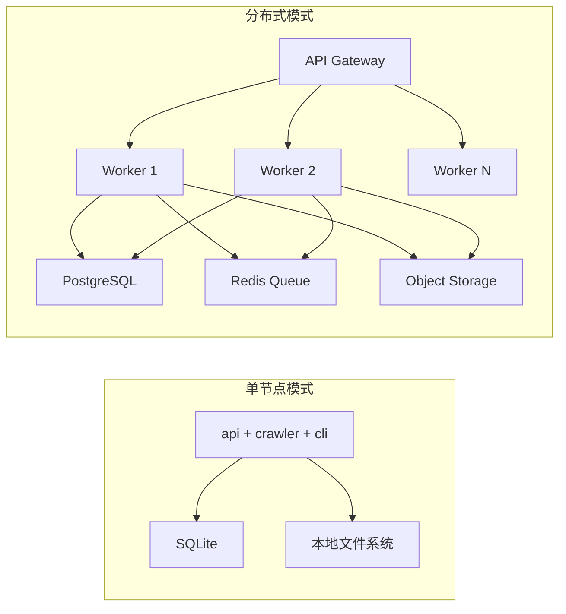

# Sentinel Crawler 架构设计文档 v2

## 1. 设计目标

构建一个**通用、可扩展、高可用**的欧空局哨兵卫星数据及元数据爬虫系统，支持：
- 多数据源无缝切换（Copernicus Data Space、AWS Open Data、Google Earth Engine 等）
- 元数据抓取与原始影像下载的解耦
- 多种存储后端可插拔（PostgreSQL、MongoDB、SQLite、S3 等）
- 多种触发方式共存（定时调度、API 手动触发、事件驱动）
- 水平扩展与分布式部署能力

## 2. 核心设计原则

| 原则 | 说明 |
|------|------|
| 依赖向内 | 领域层（`internal/domain`）是核心，不依赖任何外层包 |
| 面向接口 | 所有核心组件通过 Go interface 抽象，便于替换与 Mock 测试 |
| 依赖注入 | 使用构造函数注入依赖，组件之间无硬编码耦合 |
| Context 驱动 | 所有 I/O 操作接受 `context.Context`，支持超时与取消 |
| 错误包装 | 使用 `fmt.Errorf("...: %w", err)` 保留完整错误链 |
| 优雅关闭 | 支持 graceful shutdown，确保任务状态不丢失 |

## 3. 系统架构图



**核心规则**：箭头方向即依赖方向，永远从外层指向内层，领域层无任何外部依赖。

## 4. 模块职责

### 4.1 入口层（Entry Layer）
- **cmd/api**：REST API 服务入口，负责 HTTP 服务生命周期管理
- **cmd/crawler**：定时爬虫 Worker 入口
- **cmd/cli**：管理命令行工具（如数据库迁移、手动触发任务）

### 4.2 接口适配层（Adapter Layer）
- **HTTP Handler**：请求解析、参数校验、响应序列化，**不**包含业务逻辑
- **Cron Scheduler**：基于 cron 表达式的定时任务触发，将调度事件转为 UseCase 调用
- **Worker Consumer**：从任务队列中消费任务，调用 UseCase 执行

### 4.3 应用服务层（Application Layer）
- **CrawlUseCase**：编排一次完整的元数据抓取流程（生成任务 -> 分页抓取 -> 去重 -> 持久化）
- **DownloadUseCase**：编排影像下载流程（获取产品 -> 断点续传 -> 校验 -> 标记完成）
- **TaskUseCase**：任务生命周期管理（创建、查询、取消、重试策略）

### 4.4 领域层（Domain Layer）
- **实体**：Product、Task、DownloadState
- **接口**：Provider（数据源抽象）、Repository（存储抽象）、TaskQueue（队列抽象）

### 4.5 基础设施层（Infrastructure Layer）
- **Provider 实现**：Copernicus Data Space API、AWS S3、Google Earth Engine API
- **Repository 实现**：PostgreSQL、MongoDB、SQLite
- **Queue 实现**：内存通道、Redis Stream/RabbitMQ

## 5. 关键接口设计

### 5.1 数据源 Provider（领域层定义）

```go
package domain

import (
    "context"
    "io"
)

// Provider 定义统一的数据源接口
type Provider interface {
    // Name 返回 Provider 唯一标识名
    Name() string

    // Search 按条件搜索元数据，返回分页结果
    Search(ctx context.Context, query SearchQuery) (*SearchResult, error)

    // GetProduct 获取单个产品的完整元数据
    GetProduct(ctx context.Context, id string) (*Product, error)

    // Fetch 获取产品数据流，由调用方决定写入目标
    Fetch(ctx context.Context, product *Product) (io.ReadCloser, error)

    // HealthCheck 检查数据源可用性
    HealthCheck(ctx context.Context) error
}
```

> 设计说明：
> - `Authenticate` 从接口中移除，作为 Provider 构造时的内部行为，因为认证状态通常与 Provider 实例绑定，而非每次调用传入
> - `Download` 改为 `Fetch`，返回 `io.ReadCloser`，解耦"获取数据"与"写入存储"两个动作，支持下载到本地磁盘、S3、内存等多种目标

### 5.2 存储 Repository（领域层定义）

```go
package domain

import "context"

// ProductRepository 元数据持久化接口
type ProductRepository interface {
    Save(ctx context.Context, product *Product) error
    SaveBatch(ctx context.Context, products []*Product) error
    FindByID(ctx context.Context, id string) (*Product, error)
    FindByQuery(ctx context.Context, query ProductQuery) ([]*Product, error)
    Exists(ctx context.Context, id string) (bool, error)
    Count(ctx context.Context, query ProductQuery) (int, error)
}

// TaskRepository 任务状态持久化接口
type TaskRepository interface {
    Create(ctx context.Context, task *Task) error
    Update(ctx context.Context, task *Task) error
    FindByID(ctx context.Context, id string) (*Task, error)
    FindByStatus(ctx context.Context, status TaskStatus, limit int) ([]*Task, error)
    List(ctx context.Context, filter TaskFilter) ([]*Task, error)
    Count(ctx context.Context, filter TaskFilter) (int, error)
}

// DownloadStateRepository 断点续传状态持久化接口
type DownloadStateRepository interface {
    Save(ctx context.Context, state *DownloadState) error
    FindByTaskID(ctx context.Context, taskID string) (*DownloadState, error)
    Delete(ctx context.Context, id string) error
}
```

> 设计说明：Repository 接口定义在领域层，基础设施层的具体实现（如 `internal/repository/postgres`）依赖领域层接口，实现依赖反转。

### 5.3 任务队列（领域层定义）

```go
package domain

import "context"

// TaskQueue 任务队列抽象
type TaskQueue interface {
    // Enqueue 将任务放入队列
    Enqueue(ctx context.Context, task *Task) error

    // Dequeue 从队列中取出一个待执行任务
    Dequeue(ctx context.Context) (*Task, error)

    // Ack 确认任务成功消费
    Ack(ctx context.Context, taskID string) error

    // Nack 任务消费失败，可选择是否重新入队
    Nack(ctx context.Context, taskID string, requeue bool) error

    // Close 关闭队列连接
    Close() error
}
```

### 5.4 应用服务接口

```go
package usecase

import (
    "context"
    "github.com/lucavallin/sentinel-crawler/internal/domain"
)

// Crawler 元数据抓取编排
type Crawler interface {
    Crawl(ctx context.Context, spec domain.TaskSpec) error
}

// Downloader 影像下载编排
type Downloader interface {
    Download(ctx context.Context, taskID string, product *domain.Product, destDir string) error
    DownloadBatch(ctx context.Context, taskID string, products []*domain.Product, destDir string) error
}

// TaskManager 任务生命周期编排
type TaskManager interface {
    CreateTask(ctx context.Context, spec domain.TaskSpec) (*domain.Task, error)
    GetTask(ctx context.Context, id string) (*domain.Task, error)
    ListTasks(ctx context.Context, filter domain.TaskFilter) ([]*domain.Task, error)
    CancelTask(ctx context.Context, id string) error
    RetryTask(ctx context.Context, id string) error
}
```

> 设计说明：
> - 应用服务也定义为 interface，便于 Handler 层进行 Mock 测试
> - `Downloader` 增加 `taskID` 参数，用于关联下载进度与任务状态

## 6. 数据模型

### 6.1 Product（卫星产品）

```go
type Product struct {
    ID            string
    Name          string
    Platform      string            // S1A, S1B, S2A, S2B, S3A, S3B, S5P
    ProductType   string            // GRD, SLC, OCN, L1C, L2A, etc.
    SensingDate   time.Time
    IngestionDate time.Time
    Footprint     Geometry
    Size          int64
    DownloadURL   string
    Checksum      string
    ChecksumAlgo  string            // MD5, SHA256, etc.
    Metadata      map[string]string // 扩展元数据，限定为 string 提升可维护性
    RawXML        string            // 原始 OpenSearch/XML 响应；大体积时建议流式处理
    Source        string            // 数据源标识，如 "copernicus", "aws"
    CreatedAt     time.Time
    UpdatedAt     time.Time
}

type Geometry struct {
    Type        string
    Coordinates []any
}
```

### 6.2 Task（抓取任务）

```go
type TaskType string

const (
    TaskTypeMetadataCrawl TaskType = "metadata_crawl"
    TaskTypeDownload      TaskType = "download"
    TaskTypeFullPipeline  TaskType = "full_pipeline"
)

type TaskStatus string

const (
    TaskStatusPending    TaskStatus = "pending"
    TaskStatusQueued     TaskStatus = "queued"
    TaskStatusRunning    TaskStatus = "running"
    TaskStatusCompleted  TaskStatus = "completed"
    TaskStatusFailed     TaskStatus = "failed"
    TaskStatusCancelled  TaskStatus = "cancelled"
)

type Task struct {
    ID        string
    Type      TaskType
    Status    TaskStatus
    Spec      TaskSpec
    Progress  float64    // 0.0 ~ 1.0
    Error     string     // 失败时的错误信息
    Retries   int
    WorkerID  string     // 消费该任务的 Worker 标识
    StartedAt *time.Time
    EndedAt   *time.Time
    CreatedAt time.Time
    UpdatedAt time.Time
}

type TaskSpec struct {
    Provider   string
    Query      SearchQuery
    DestDir    string
    MaxRetries int
}
```

> 变更说明：增加 `TaskStatusQueued` 区分"已创建"与"已入队"，增加 `WorkerID` 便于分布式场景下排查问题。

### 6.3 DownloadState（断点续传状态）

```go
type DownloadState struct {
    ID               string
    TaskID           string
    ProductID        string
    DestPath         string
    TotalBytes       int64
    ReceivedBytes    int64
    ChecksumExpected string
    Status           string // pending / downloading / paused / completed / failed
    CreatedAt        time.Time
    UpdatedAt        time.Time
}
```

## 7. 任务队列与并发控制

### 7.1 队列选择策略

| 部署模式 | 推荐队列 | 说明 |
|----------|----------|------|
| 单节点 | Memory Queue | 基于 channel 实现，零外部依赖 |
| 多 Worker | Redis Queue | 支持分布式 Ack/Nack 与持久化 |

### 7.2 并发控制

- **Crawl 并发**：控制对 Provider API 的并发请求数，使用 `golang.org/x/sync/semaphore` 或带缓冲 channel
- **Download 并发**：
  - 产品级：同时下载多少个产品（由 `DownloadConfig.Workers` 控制）
  - 分片级：单个产品是否启用多线程分片下载（由 `DownloadConfig.ChunkSize` 控制）
- **DB 写入并发**：批量写入时使用 `SaveBatch`，通过事务保证原子性

### 7.3 任务幂等性

- 元数据抓取：以 `Product.ID` 为主键，`ProductRepository.Exists` 去重
- 下载任务：以 `DownloadState.TaskID + ProductID` 为唯一键，避免重复下载

## 8. 断点续传设计



## 9. 可观测性设计

### 9.1 结构化日志

使用 Go 标准库 `log/slog`，所有日志包含：
- `task_id`：任务级链路追踪
- `provider`：数据源标识
- `duration_ms`：操作耗时
- `error`：错误信息（如有）

### 9.2 指标暴露

通过 Prometheus 格式暴露 `/metrics`：

| 指标名 | 类型 | 说明 |
|--------|------|------|
| `sentinel_crawl_total` | Counter | 抓取任务总数 |
| `sentinel_crawl_duration_seconds` | Histogram | 抓取耗时 |
| `sentinel_download_total` | Counter | 下载任务总数 |
| `sentinel_download_bytes_total` | Counter | 下载字节数 |
| `sentinel_provider_request_duration_seconds` | Histogram | Provider API 请求耗时 |
| `sentinel_task_queue_size` | Gauge | 队列积压任务数 |

### 9.3 健康检查

- `GET /health`：依赖健康检查（Provider HealthCheck + DB Ping）
- `GET /ready`：服务是否准备好接收流量

## 10. 配置管理

### 10.1 配置分层

支持多级配置覆盖（优先级从低到高）：
1. 默认值（代码中内置）
2. 配置文件（`configs/config.yaml`）
3. 环境变量（`SENTINEL_CRAWLER_*`）
4. 命令行参数

### 10.2 Provider 配置设计

每个数据源拥有独立的强类型配置结构，避免使用 `map[string]any` 导致类型不安全：

```go
type ProvidersConfig struct {
    Active     string             // 当前激活的 Provider 名称
    Copernicus CopernicusConfig   // Copernicus Data Space 配置
    AWS        AWSConfig          // AWS Open Data 预留
}

type CopernicusConfig struct {
    Enabled             bool
    BaseURL             string  // OData Catalogue API 地址
    DownloadBaseURL     string  // 下载服务地址（可能与搜索不同）
    TokenURL            string  // OAuth2 Token 端点
    ClientID            string  // OAuth2 Client ID
    ClientSecret        string  // OAuth2 Client Secret
    Username            string  // 用户名认证（备选方案）
    Password            string  // 密码认证（备选方案）
    Timeout             int     // HTTP 请求超时（秒）
    RateLimit           int     // 每秒请求数限制
    MaxResultsPerQuery  int     // 单次搜索最大返回数
}
```

**设计要点**：
- **激活机制**：通过 `ProvidersConfig.Active` 指定当前使用的 Provider，而非单一全局配置
- **独立地址**：`BaseURL` 与 `DownloadBaseURL` 分离，Copernicus 的搜索与下载服务部署在不同域名
- **双认证模式**：支持 OAuth2 Client Credentials（推荐）和用户名密码（备选）
- **限流保护**：`RateLimit` 防止触发 Copernicus API 的限流策略
- **环境变量注入**：敏感字段（`ClientSecret`、`Password`）通过环境变量覆盖，不写入配置文件

### 10.3 配置示例

```yaml
providers:
  active: copernicus
  copernicus:
    enabled: true
    base_url: https://catalogue.dataspace.copernicus.eu/odata/v1
    download_base_url: https://download.dataspace.copernicus.eu
    token_url: https://identity.dataspace.copernicus.eu/auth/realms/CDSE/protocol/openid-connect/token
    client_id: ""
    client_secret: ""           # 通过 SENTINEL_CRAWLER_PROVIDERS_COPERNICUS_CLIENT_SECRET 注入
    username: ""
    password: ""                # 通过 SENTINEL_CRAWLER_PROVIDERS_COPERNICUS_PASSWORD 注入
    timeout: 30
    rate_limit: 10
    max_results_per_query: 1000
  aws:
    enabled: false
    region: eu-central-1
    bucket: ""
    access_key: ""
    secret_key: ""
```

## 11. 部署架构



> **重要限制**：单节点模式使用 SQLite 时，如果同时运行 `cmd/api` 和 `cmd/crawler` 两个进程，需要开启 SQLite WAL 模式，或改用文件锁机制。建议单节点模式下使用单一进程内多 goroutine，而非多进程。

## 12. 扩展点

| 扩展点 | 说明 |
|--------|------|
| Provider | 实现 `domain.Provider` 接口即可接入新数据源 |
| Repository | 实现 `domain.ProductRepository` / `domain.TaskRepository` 即可切换数据库 |
| Queue | 实现 `domain.TaskQueue` 即可切换队列实现 |
| UseCase | 在标准流程前后插入 Pipeline Hook（如格式转换、缩略图生成） |
| Middleware | API 层的认证、限流、日志中间件 |

## 13. 已知限制

1. **SQLite 并发写入**：WAL 模式下支持多读一写，但仍建议避免多进程高并发写入
2. **大体积 RawXML**：`Product.RawXML` 在内存中保留完整 XML，单产品元数据过大时建议流式解析后丢弃原文
3. **配置热更新**：当前版本不支持运行时热加载配置，修改后需重启进程
